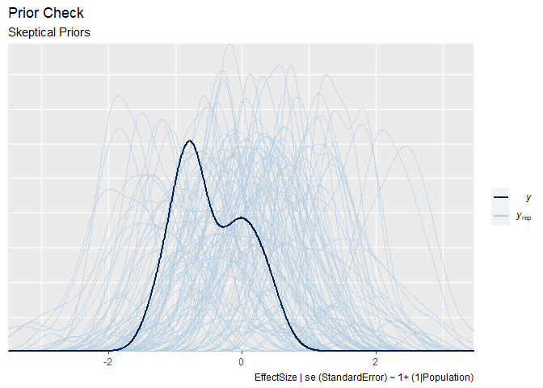

Assignment 4 - Applying meta-analytic priors
================
Riccardo Fusaroli

## Assignment 4

In this assignment we do the following: - we run a Bayesian
meta-analysis of pitch variability in ASD, based on previously published
literature - we analyze pitch variability in ASD in two new studies
using both a conservative and a meta-analytic prior - we assess the
difference in model quality and estimates using the two priors.

The questions you need to anwser are: What are the consequences of using
a meta-analytic prior? Evaluate the models with conservative and
meta-analytic priors. Discuss the effects on estimates. Discuss the
effects on model quality. Discuss the role that meta-analytic priors
should have in scientific practice. Should we systematically use them?
Do they have drawbacks? Should we use them to complement more
conservative approaches? How does the use of meta-analytic priors you
suggest reflect the skeptical and cumulative nature of science?

### Step by step suggestions

Step 1: Perform a meta-analysis of pitch variability from previous
studies of voice in ASD - the data is available as
Ass4\_MetaAnalysisData.tsv - You should calculate Effect size (cohen’s
d) and Standard Error (uncertainty in the Cohen’s d) per each study,
using escalc() from the metafor package (also check the livecoding
intro) - N.B. we’re only interested in getting a meta-analytic effect
size for the meta-analytic prior (and not e.g. all the stuff on
publication bias). See a brms tutorial here:
<https://vuorre.netlify.com/post/2016/09/29/meta-analysis-is-a-special-case-of-bayesian-multilevel-modeling/>
The formula is EffectSize | se(StandardError) \~ 1 + (1 | Paper). Don’t
forget prior definition, model checking, etc. - Write down the results
of the meta-analysis in terms of a prior for step 2.

``` r
#load data and packages

pacman::p_load(pacman, tidyverse, brms, psych, metafor, parallel, patchwork)

cores = detectCores()

dataMetaAnalysis <- read_delim("Ass4_MetaAnalysisData.tsv",
                               "\t")
```

    ## Parsed with column specification:
    ## cols(
    ##   .default = col_double(),
    ##   Paper = col_character(),
    ##   Author = col_character(),
    ##   Population = col_character(),
    ##   DiagnosisDetails = col_character(),
    ##   Language = col_character(),
    ##   Language2 = col_character(),
    ##   Task = col_character(),
    ##   Task2 = col_character(),
    ##   PitchMean_Units = col_character(),
    ##   PitchMeanASDvsTD = col_character(),
    ##   PitchRange_Units = col_character(),
    ##   PitchRangeASDvsTD = col_character(),
    ##   PitchSD_Units = col_character(),
    ##   PitchSDASDvsTD = col_character(),
    ##   PitchVariability_Units = col_character(),
    ##   PitchVariabilityASDvsTD = col_character(),
    ##   IntensityMean_Units = col_character(),
    ##   IntensityMeanASDvsTD = col_character(),
    ##   UtteranceDurationUnit = col_character(),
    ##   UtteranceDurationASDvsTD = col_character()
    ##   # ... with 5 more columns
    ## )

    ## See spec(...) for full column specifications.

``` r
dataMetaAnalysis <- dataMetaAnalysis %>%
  mutate_at(
    c(
      "PitchVariabilityASD_Mean",
      "PitchVariabilityASD_SD",
      "PitchVariabilityTD_Mean",
      "PitchVariabilityTD_SD"
    ),
    as.numeric
  )

#describe(dataMetaAnalysis)

#head(dataMetaAnalysis)

#removing papers without titles
dataMetaAnalysis <- dataMetaAnalysis %>% subset(!is.na(Paper))


#creating yi and vi for metaAnalysis
dataMetaAnalysis <- escalc(
  measure = "SMD",
  n1i = TD_N,
  n2i = ASD_N,
  m1i = PitchVariabilityTD_Mean,
  m2i = PitchVariabilityASD_Mean,
  sd1i = PitchVariabilityTD_SD,
  sd2i = PitchVariabilityASD_SD,
  data = dataMetaAnalysis,
  slab = Paper
)

dataMetaAnalysis <- dataMetaAnalysis %>%
  mutate(StandardError = sqrt(vi)) %>%
  rename(EffectSize = yi)

summary(dataMetaAnalysis$EffectSize)
```

    ##     Min.  1st Qu.   Median     Mean  3rd Qu.     Max.     NA's 
    ## -1.29110 -0.81658 -0.65338 -0.46315 -0.05907  0.52031       11

``` r
summary(dataMetaAnalysis$StandardError)
```

    ##    Min. 1st Qu.  Median    Mean 3rd Qu.    Max.    NA's 
    ##  0.2211  0.3176  0.3732  0.3673  0.4243  0.4826      11

``` r
metaFormula <-
  bf(EffectSize | se (StandardError) ~ 1 + (1 | Population))

get_prior(metaFormula, data = dataMetaAnalysis, family = gaussian())
```

    ## Warning: Rows containing NAs were excluded from the model.

    ##                  prior     class      coef      group resp dpar nlpar bound
    ## 1 student_t(3, -1, 10) Intercept                                           
    ## 2  student_t(3, 0, 10)        sd                                           
    ## 3                             sd           Population                      
    ## 4                             sd Intercept Population

``` r
#I Think this is a skeptial prior, but I'm not sure...

sd(dataMetaAnalysis$EffectSize, na.rm = T)#0.5
```

    ## [1] 0.5163518

``` r
metaAnalysis_Prior <- c(prior(normal(0, 1), class = Intercept),
                        prior(normal(0, .25), class = sd))

metaAnalysis_m0 <- brm(
  metaFormula,
  data = dataMetaAnalysis,
  family = gaussian(),
  prior = metaAnalysis_Prior,
  sample_prior = "only",
  chains = 2,
  cores = cores,
  file = "priorCheckSkeptical"
)

#prior predictive Check
priorCheck_metaAnalysis_m0 <-
  pp_check(metaAnalysis_m0, nsamples = 100)

priorCheck_metaAnalysis_m0 + labs(title = "Prior Check",
                                  subtitle = "Skeptical Priors",
                                  caption = "EffectSize | se (StandardError) ~ 1+ (1|Population)")
```

<!-- -->

``` r
#fitting model
metaAnalysis_m1 <- brm(
  metaFormula,
  data = dataMetaAnalysis,
  family = gaussian(),
  prior = metaAnalysis_Prior,
  sample_prior = T,
  chains = 2,
  cores = cores,
  file = "metaAnalysis_m1"
)

#posterior predictive check

pp_check(metaAnalysis_m1, nsamples = 100) + labs(title = "Posterior Check",
                                                 subtitle = "Skeptical Priors",
                                                 caption = "EffectSize | se (StandardError) ~ 1+ (1|Population)") 
```

<!-- -->

``` r
#checking model
summary(metaAnalysis_m1) # effect of 0.43 sd = 0.10
```

    ##  Family: gaussian 
    ##   Links: mu = identity; sigma = identity 
    ## Formula: EffectSize | se(StandardError) ~ 1 + (1 | Population) 
    ##    Data: dataMetaAnalysis (Number of observations: 30) 
    ## Samples: 2 chains, each with iter = 2000; warmup = 1000; thin = 1;
    ##          total post-warmup samples = 2000
    ## 
    ## Group-Level Effects: 
    ## ~Population (Number of levels: 26) 
    ##               Estimate Est.Error l-95% CI u-95% CI Rhat Bulk_ESS Tail_ESS
    ## sd(Intercept)     0.31      0.09     0.12     0.50 1.00      847      833
    ## 
    ## Population-Level Effects: 
    ##           Estimate Est.Error l-95% CI u-95% CI Rhat Bulk_ESS Tail_ESS
    ## Intercept    -0.43      0.09    -0.60    -0.25 1.00     1329     1082
    ## 
    ## Samples were drawn using sampling(NUTS). For each parameter, Bulk_ESS
    ## and Tail_ESS are effective sample size measures, and Rhat is the potential
    ## scale reduction factor on split chains (at convergence, Rhat = 1).

``` r
analysisMean <- fixef(metaAnalysis_m1)[[1]]
analysis_SE <- fixef(metaAnalysis_m1)[[2]]
analysisHeterogeneity = 0.31
```

Step 2: Analyse pitch variability in ASD in two new studies for which
you have access to all the trials (not just study level estimates) - the
data is available as Ass4\_data.csv. Notice there are 2 studies
(language us, and language dk), multiple trials per participant, and a
few different ways to measure pitch variability (if in doubt, focus on
pitch IQR, interquartile range of the log of fundamental frequency) -
Also, let’s standardize the data, so that they are compatible with our
meta-analytic prior (Cohen’s d is measured in SDs). - Is there any
structure in the dataset that we should account for with random/varying
effects? How would you implement that? Or, if you don’t know how to do
bayesian random/varying effects or don’t want to bother, is there
anything we would need to simplify in the dataset?

``` r
#loading data
newData <-
  read_csv("Ass4_data.csv", col_types = cols(ID = col_character()))

#checking classes
#head(newData)
#lapply(newData, class)

newData <- newData %>% mutate(PitchVariability = scale(Pitch_IQR))

hist(newData$PitchVariability)
```

<!-- -->

``` r
ASD_DensityPitch <-
  ggplot(data = filter(newData, Diagnosis == "ASD"), aes(PitchVariability, )) + geom_density() + ggtitle("Distribution of Pitch Variability IQ in ASD") + theme(legend.position = "none") + theme(plot.title = element_text(color = "red", size = 10, face = "bold"))

TD_DensityPitch <-
  ggplot(data = filter(newData, Diagnosis == "TD"), aes(PitchVariability, )) + geom_density() + ggtitle("Distribution of Pitch Variability IQ in TD") + theme(legend.position = "none") + theme(plot.title = element_text(color = "red", size = 10, face = "bold"))

ASD_DensityPitch + TD_DensityPitch
```

<!-- -->

``` r
#lets take a look at the structure of the data

##language only have two levels and it doesn't change, so that is a fixed effect.

##ID people might vary differently, so we will conewStudiesider that a varying effect

##Verbal IQ may interact with diagnosis and it the data does not look too skewed to cause trouble

ASD_Density_VIQ <-
  ggplot(data = filter(newData, Diagnosis == "ASD"), aes(VIQ, color = ID)) + geom_density() + ggtitle("Distribution of Verbal IQ in ASD") + theme(legend.position = "none") + theme(plot.title = element_text(size = 10, face = "bold"))


TD_Density_VIQ <-
  ggplot(data = filter(newData, Diagnosis == "TD"), aes(VIQ, color = ID)) + geom_density() + ggtitle("Distribution of Verbal IQ in TD") + theme(legend.position = "none") + theme(plot.title = element_text(size = 10, face = "bold"))


ASD_Density_VIQ + TD_Density_VIQ
```

    ## Warning: Removed 90 rows containing non-finite values (stat_density).

    ## Warning: Removed 70 rows containing non-finite values (stat_density).

<!-- -->

Step 3: Build a regression model predicting Pitch variability from
Diagnosis. - how is the outcome distributed? (likelihood function). NB.
given we are standardizing, and the meta-analysis is on that scale,
gaussian is not a bad assumption. Lognormal would require us to convert
the prior to that scale. - how are the parameters of the likelihood
distribution distributed? Which predictors should they be conditioned
on? Start simple, with Diagnosis only. Add other predictors only if you
have the time and energy\! - use a skeptical/conservative prior for the
effects of diagnosis. Remember you’ll need to motivate it. - Evaluate
model quality. Describe and plot the estimates.

``` r
#formulas
newStudies_f0 <- bf(PitchVariability ~ 1 + Diagnosis + (1 | ID))

newStudies_f1 <-
  bf(PitchVariability ~ 0 + Language + Diagnosis:Language + (1 |
                                                               ID))

get_prior(newStudies_f0, newData, family = gaussian())
```

    ##                 prior     class        coef group resp dpar nlpar bound
    ## 1                             b                                        
    ## 2                             b DiagnosisTD                            
    ## 3 student_t(3, 0, 10) Intercept                                        
    ## 4 student_t(3, 0, 10)        sd                                        
    ## 5                            sd                ID                      
    ## 6                            sd   Intercept    ID                      
    ## 7 student_t(3, 0, 10)     sigma

``` r
#skeptical prior
newStudiesPrior0 <- c(
  prior(normal(0, .3), class = Intercept),
  prior(normal(0, .1), class = b),
  prior(normal(0, .1), class = sd),
  prior(normal(.5, .3), class = sigma)
)


newStudies_m0_pc <- brm(
  newStudies_f0,
  data = newData,
  family = gaussian(),
  prior = newStudiesPrior0,
  sample_prior = "only",
  chains = 2,
  cores = cores,
  file = "NewStudies_m0Prior"
)

pp_check(newStudies_m0_pc, nsamples = 100) + labs(title = "Prior Check",
                                                  subtitle = "Skeptical Priors",
                                                  caption = "PitchVariability ~ 1 + Diagnosis + (1 | ID)") 
```

<!-- -->

``` r
newStudies_m0 <- brm(
  newStudies_f0,
  data = newData,
  family = gaussian(),
  prior = newStudiesPrior0,
  sample_prior = T,
  chains = 2,
  cores = cores,
  file = "NewStudies_m0"
)

plot(newStudies_m0)
```

<!-- -->

``` r
pp_check(newStudies_m0, nsamples = 100) + labs(title = "Posterior Check",
                                               subtitle = "Skeptical Priors",
                                               caption = "PitchVariability ~ 1 + Diagnosis + (1 | ID)") 
```

<!-- -->

``` r
# hypothesis testing
hypo_m0 <-
  plot(hypothesis(newStudies_m0, "DiagnosisTD < 0"), plot = F)

hypo_m0[[1]] + labs(title = "DiagnosisTD < 0",
                    subtitle = "Skeptical Priors",
                    caption = "PitchVariability ~ 1 + Diagnosis + (1 | ID)") + theme(strip.text = element_blank())
```

<!-- -->

``` r
hypothesis(newStudies_m0, "DiagnosisTD < 0")
```

    ## Hypothesis Tests for class b:
    ##          Hypothesis Estimate Est.Error CI.Lower CI.Upper Evid.Ratio Post.Prob
    ## 1 (DiagnosisTD) < 0    -0.08      0.07     -0.2     0.05       5.94      0.86
    ##   Star
    ## 1     
    ## ---
    ## 'CI': 90%-CI for one-sided and 95%-CI for two-sided hypotheses.
    ## '*': For one-sided hypotheses, the posterior probability exceeds 95%;
    ## for two-sided hypotheses, the value tested against lies outside the 95%-CI.
    ## Posterior probabilities of point hypotheses assume equal prior probabilities.

``` r
#interactionmodel
get_prior(newStudies_f1, newData, family = gaussian())
```

    ##                 prior class                   coef group resp dpar nlpar bound
    ## 1                         b                                                   
    ## 2                         b             Languagedk                            
    ## 3                         b Languagedk:DiagnosisTD                            
    ## 4                         b             Languageus                            
    ## 5                         b Languageus:DiagnosisTD                            
    ## 6 student_t(3, 0, 10)    sd                                                   
    ## 7                        sd                           ID                      
    ## 8                        sd              Intercept    ID                      
    ## 9 student_t(3, 0, 10) sigma

``` r
# set priors
NewStudiesPrior1 <- c(
  prior(normal(0, .1), class = b, coef = "Languagedk"),
  prior(normal(0, .1), class = b, coef = "Languageus"),
  prior(normal(0, .1), class = b, coef = "Languagedk:DiagnosisTD"),
  prior(normal(0, .1), class = b, coef = "Languageus:DiagnosisTD"),
  prior(normal(0, .1), class = sd),
  prior(normal(.5, .1), class = sigma)
)


newStudies_m1_pc <- brm(
  newStudies_f1,
  newData,
  family = gaussian(),
  prior = NewStudiesPrior1,
  sample_prior = "only",
  chains = 2,
  cores = cores,
  file = "newStudies_m1_pc"
  
)

pp_check(newStudies_m1_pc, nsamples = 100) + labs(title = "Prior Check",
                                                  subtitle = "Skeptical Priors",
                                                  caption = "PitchVariability~0 + Language + Diagnosis:Language+(1|ID) ")
```

<!-- -->

``` r
newStudies_m1 <- brm(
  newStudies_f1,
  newData,
  family = gaussian(),
  prior = NewStudiesPrior1,
  sample_prior = T,
  chains = 2,
  cores = cores,
  file = "newStudies_m1"
  
)


# posterior predictive check
pp_check(newStudies_m1, nsamples = 100) + labs(title = "Posterior Check",
                                               subtitle = "Skeptical Priors",
                                               caption = "PitchVariability~0 + Language + Diagnosis:Language+(1|ID)")
```

<!-- -->

``` r
# hypothesis testing
hypo_m1_dk <-
  plot(hypothesis(newStudies_m1, "Languagedk:DiagnosisTD < 0"), plot = F)

hypo_m1_dk[[1]] + labs(title =  "Languagedk:DiagnosisTD < 0",
                       subtitle = "Skeptical Priors",
                       caption = "PitchVariability~0 + Language + Diagnosis:Language+(1|ID)") + theme(strip.text = element_blank())
```

<!-- -->

``` r
hypo_m1_us <-
  plot(hypothesis(newStudies_m1, "Languageus:DiagnosisTD < 0"), plot = F)

hypo_m1_us[[1]] + labs(title =  "Languageus:DiagnosisTD < 0",
                       subtitle = "Skeptical Priors",
                       caption = "PitchVariability~0 + Language + Diagnosis:Language+(1|ID)") + theme(strip.text = element_blank())
```

<!-- -->

``` r
hypothesis(newStudies_m1, "Languagedk:DiagnosisTD < 0")
```

    ## Hypothesis Tests for class b:
    ##                 Hypothesis Estimate Est.Error CI.Lower CI.Upper Evid.Ratio
    ## 1 (Languagedk:Diagn... < 0    -0.14      0.08    -0.27    -0.01      29.77
    ##   Post.Prob Star
    ## 1      0.97    *
    ## ---
    ## 'CI': 90%-CI for one-sided and 95%-CI for two-sided hypotheses.
    ## '*': For one-sided hypotheses, the posterior probability exceeds 95%;
    ## for two-sided hypotheses, the value tested against lies outside the 95%-CI.
    ## Posterior probabilities of point hypotheses assume equal prior probabilities.

``` r
hypothesis(newStudies_m1, "Languageus:DiagnosisTD < 0")
```

    ## Hypothesis Tests for class b:
    ##                 Hypothesis Estimate Est.Error CI.Lower CI.Upper Evid.Ratio
    ## 1 (Languageus:Diagn... < 0     0.17      0.08     0.05     0.31       0.01
    ##   Post.Prob Star
    ## 1      0.01     
    ## ---
    ## 'CI': 90%-CI for one-sided and 95%-CI for two-sided hypotheses.
    ## '*': For one-sided hypotheses, the posterior probability exceeds 95%;
    ## for two-sided hypotheses, the value tested against lies outside the 95%-CI.
    ## Posterior probabilities of point hypotheses assume equal prior probabilities.

``` r
hypo_m1_dk_us <- plot(
  hypothesis(
    newStudies_m1,
    "Languagedk:DiagnosisTD < Languageus:DiagnosisTD"
  ),
  plot = F
)


hypo_m1_dk_us[[1]] + labs(title =  "Languagedk:DiagnosisTD < Languageus:DiagnosisTD",
                          subtitle = "Skeptical Priors",
                          caption = "PitchVariability~0 + Language + Diagnosis:Language+(1|ID)") + theme(strip.text = element_blank())
```

<!-- -->

``` r
hypothesis(newStudies_m1,
           "Languagedk:DiagnosisTD < Languageus:DiagnosisTD")
```

    ## Hypothesis Tests for class b:
    ##                 Hypothesis Estimate Est.Error CI.Lower CI.Upper Evid.Ratio
    ## 1 (Languagedk:Diagn... < 0    -0.32      0.11     -0.5    -0.13        399
    ##   Post.Prob Star
    ## 1         1    *
    ## ---
    ## 'CI': 90%-CI for one-sided and 95%-CI for two-sided hypotheses.
    ## '*': For one-sided hypotheses, the posterior probability exceeds 95%;
    ## for two-sided hypotheses, the value tested against lies outside the 95%-CI.
    ## Posterior probabilities of point hypotheses assume equal prior probabilities.

``` r
summary(newStudies_m1)
```

    ##  Family: gaussian 
    ##   Links: mu = identity; sigma = identity 
    ## Formula: PitchVariability ~ 0 + +Language + Diagnosis:Language + (1 | ID) 
    ##    Data: newData (Number of observations: 1074) 
    ## Samples: 2 chains, each with iter = 2000; warmup = 1000; thin = 1;
    ##          total post-warmup samples = 2000
    ## 
    ## Group-Level Effects: 
    ## ~ID (Number of levels: 149) 
    ##               Estimate Est.Error l-95% CI u-95% CI Rhat Bulk_ESS Tail_ESS
    ## sd(Intercept)     0.52      0.04     0.45     0.59 1.00      591      931
    ## 
    ## Population-Level Effects: 
    ##                        Estimate Est.Error l-95% CI u-95% CI Rhat Bulk_ESS
    ## Languagedk                -0.14      0.06    -0.26    -0.01 1.00      906
    ## Languageus                 0.43      0.06     0.31     0.55 1.00     1490
    ## Languagedk:DiagnosisTD    -0.14      0.08    -0.29     0.01 1.00     1107
    ## Languageus:DiagnosisTD     0.17      0.08     0.03     0.33 1.00     1735
    ##                        Tail_ESS
    ## Languagedk                 1129
    ## Languageus                 1623
    ## Languagedk:DiagnosisTD     1598
    ## Languageus:DiagnosisTD     1503
    ## 
    ## Family Specific Parameters: 
    ##       Estimate Est.Error l-95% CI u-95% CI Rhat Bulk_ESS Tail_ESS
    ## sigma     0.70      0.02     0.67     0.73 1.00     2669     1545
    ## 
    ## Samples were drawn using sampling(NUTS). For each parameter, Bulk_ESS
    ## and Tail_ESS are effective sample size measures, and Rhat is the potential
    ## scale reduction factor on split chains (at convergence, Rhat = 1).

``` r
condEff <- plot(conditional_effects(newStudies_m1),plot = F)

condEff[[1]] + labs(title =  "Effect of Language",
                    subtitle = "Skeptical Priors",
                    caption = "PitchVariability~0 + Language + Diagnosis:Language+(1|ID)")
```

<!-- -->

``` r
condEff[[2]] + labs(title =  "Effect of Language:Diagnosis",
                    subtitle = "Skeptical Priors",
                    caption = "PitchVariability~0 + Language + Diagnosis:Language+(1|ID)")
```

<!-- -->

``` r
newStudies_m0 <- add_criterion(newStudies_m0, criterion = "loo")
```

    ## Warning: Found 3 observations with a pareto_k > 0.7 in model 'newStudies_m0'. It
    ## is recommended to set 'reloo = TRUE' in order to calculate the ELPD without the
    ## assumption that these observations are negligible. This will refit the model 3
    ## times to compute the ELPDs for the problematic observations directly.

    ## Automatically saving the model object in 'NewStudies_m0.rds'

``` r
newStudies_m1 <- add_criterion(newStudies_m1, criterion = "loo")
```

    ## Warning: Found 3 observations with a pareto_k > 0.7 in model 'newStudies_m1'. It
    ## is recommended to set 'reloo = TRUE' in order to calculate the ELPD without the
    ## assumption that these observations are negligible. This will refit the model 3
    ## times to compute the ELPDs for the problematic observations directly.

    ## Automatically saving the model object in 'newStudies_m1.rds'

``` r
loo_model_weights(newStudies_m0, newStudies_m1)
```

    ## Warning: Some Pareto k diagnostic values are too high. See help('pareto-k-diagnostic') for details.

    ## Warning: Some Pareto k diagnostic values are too high. See help('pareto-k-diagnostic') for details.

    ## Method: stacking
    ## ------
    ##               weight
    ## newStudies_m0 0.157 
    ## newStudies_m1 0.843

Step 4: Now re-run the model with the meta-analytic prior - Evaluate
model quality. Describe and plot the estimates.

``` r
analysis_Mean <- fixef(metaAnalysis_m1)[[1]]
analysis_SE <- fixef(metaAnalysis_m1)[[2]]
analysisHeterogeneity = 0.31

# new priors set from old meta study ^
newStudiesInformed_prior <- c(
  prior(normal(.2, .3), class = b, coef = "Languagedk"),
  prior(normal(.2, .3), class = b, coef = "Languageus"),
  prior(normal(-0.43, .1), class = b, coef = "Languagedk:DiagnosisTD"),
  prior(normal(-0.43, .1), class = b, coef = "Languageus:DiagnosisTD"),
  prior(normal(0, .1), class = sd),
  prior(normal(.32, .1), class = sigma)
)

newStudiesInformed_m1_pc <- brm(
  newStudies_f1,
  newData,
  family = gaussian(),
  prior = newStudiesInformed_prior,
  sample_prior = "only",
  chains = 2,
  cores = cores,
  file = "newStudiesInformed_m1_pc"
)

pp_check(newStudiesInformed_m1_pc, nsamples = 100) + labs(title = "Prior Check",
                                                          subtitle = "Informed Priors",
                                                          caption = "PitchVariability~0 + Language + Diagnosis:Language+(1|ID) ")
```

<!-- -->

``` r
newStudiesInformed_m1 <- brm(
  newStudies_f1,
  newData,
  family = gaussian(),
  prior = newStudiesInformed_prior,
  sample_prior = T,
  chains = 2,
  cores = cores,
  file = "newStudiesInformed_m"
)

pp_check(newStudiesInformed_m1, nsamples = 100) + labs(title = "Posterior Check",
       subtitle = "Informed Priors",
       caption = "PitchVariability~0 + Language + Diagnosis:Language+(1|ID) ") 
```

<!-- -->

``` r
# hypothesis testing
hypoInformed_dk <-
  plot(hypothesis(newStudiesInformed_m1, "Languagedk:DiagnosisTD < 0"),
       plot = F)

hypoInformed_dk[[1]] + labs(title =  "Languagedk:DiagnosisTD < 0",
                            subtitle = "Informed Priors",
                            caption = "PitchVariability~0 + Language + Diagnosis:Language+(1|ID)") + theme(strip.text = element_blank())
```

<!-- -->

``` r
hypoInformed_us <-
  plot(hypothesis(newStudiesInformed_m1, "Languageus:DiagnosisTD < 0"),
       plot = F)

hypoInformed_us[[1]] + labs(title =  "Languageus:DiagnosisTD < 0",
                            subtitle = "Informed Priors",
                            caption = "PitchVariability~0 + Language + Diagnosis:Language+(1|ID)") + theme(strip.text = element_blank())
```

<!-- -->

``` r
hypothesis(newStudiesInformed_m1, "Languagedk:DiagnosisTD < 0")
```

    ## Hypothesis Tests for class b:
    ##                 Hypothesis Estimate Est.Error CI.Lower CI.Upper Evid.Ratio
    ## 1 (Languagedk:Diagn... < 0    -0.38      0.08    -0.51    -0.25        Inf
    ##   Post.Prob Star
    ## 1         1    *
    ## ---
    ## 'CI': 90%-CI for one-sided and 95%-CI for two-sided hypotheses.
    ## '*': For one-sided hypotheses, the posterior probability exceeds 95%;
    ## for two-sided hypotheses, the value tested against lies outside the 95%-CI.
    ## Posterior probabilities of point hypotheses assume equal prior probabilities.

``` r
hypothesis(newStudiesInformed_m1, "Languageus:DiagnosisTD < 0")
```

    ## Hypothesis Tests for class b:
    ##                 Hypothesis Estimate Est.Error CI.Lower CI.Upper Evid.Ratio
    ## 1 (Languageus:Diagn... < 0    -0.22      0.08    -0.35    -0.08     284.71
    ##   Post.Prob Star
    ## 1         1    *
    ## ---
    ## 'CI': 90%-CI for one-sided and 95%-CI for two-sided hypotheses.
    ## '*': For one-sided hypotheses, the posterior probability exceeds 95%;
    ## for two-sided hypotheses, the value tested against lies outside the 95%-CI.
    ## Posterior probabilities of point hypotheses assume equal prior probabilities.

``` r
hypoInformed_dk_us <-  plot(
  hypothesis(
    newStudiesInformed_m1,
    "Languagedk:DiagnosisTD < Languageus:DiagnosisTD"
  ),
  plot = F
)

hypoInformed_dk_us[[1]] + labs(title =  "Languagedk:DiagnosisTD < Languageus:DiagnosisTD",
                               subtitle = "Informed Priors",
                               caption = "PitchVariability~0 + Language + Diagnosis:Language+(1|ID)") + theme(strip.text = element_blank())
```

<!-- -->

``` r
hypothesis(newStudiesInformed_m1,
           "Languagedk:DiagnosisTD < Languageus:DiagnosisTD")
```

    ## Hypothesis Tests for class b:
    ##                 Hypothesis Estimate Est.Error CI.Lower CI.Upper Evid.Ratio
    ## 1 (Languagedk:Diagn... < 0    -0.17      0.11    -0.36     0.02      12.42
    ##   Post.Prob Star
    ## 1      0.93     
    ## ---
    ## 'CI': 90%-CI for one-sided and 95%-CI for two-sided hypotheses.
    ## '*': For one-sided hypotheses, the posterior probability exceeds 95%;
    ## for two-sided hypotheses, the value tested against lies outside the 95%-CI.
    ## Posterior probabilities of point hypotheses assume equal prior probabilities.

``` r
summary(newStudiesInformed_m1)
```

    ##  Family: gaussian 
    ##   Links: mu = identity; sigma = identity 
    ## Formula: PitchVariability ~ 0 + Language + Diagnosis:Language + (1 | ID) 
    ##    Data: newData (Number of observations: 1074) 
    ## Samples: 2 chains, each with iter = 2000; warmup = 1000; thin = 1;
    ##          total post-warmup samples = 2000
    ## 
    ## Group-Level Effects: 
    ## ~ID (Number of levels: 149) 
    ##               Estimate Est.Error l-95% CI u-95% CI Rhat Bulk_ESS Tail_ESS
    ## sd(Intercept)     0.52      0.03     0.45     0.59 1.00      832     1114
    ## 
    ## Population-Level Effects: 
    ##                        Estimate Est.Error l-95% CI u-95% CI Rhat Bulk_ESS
    ## Languagedk                -0.05      0.08    -0.20     0.10 1.00      460
    ## Languageus                 0.77      0.08     0.62     0.93 1.00      826
    ## Languagedk:DiagnosisTD    -0.38      0.08    -0.54    -0.23 1.00      881
    ## Languageus:DiagnosisTD    -0.22      0.08    -0.37    -0.06 1.00     1615
    ##                        Tail_ESS
    ## Languagedk                  855
    ## Languageus                  902
    ## Languagedk:DiagnosisTD     1213
    ## Languageus:DiagnosisTD     1682
    ## 
    ## Family Specific Parameters: 
    ##       Estimate Est.Error l-95% CI u-95% CI Rhat Bulk_ESS Tail_ESS
    ## sigma     0.70      0.02     0.67     0.73 1.00     2241     1303
    ## 
    ## Samples were drawn using sampling(NUTS). For each parameter, Bulk_ESS
    ## and Tail_ESS are effective sample size measures, and Rhat is the potential
    ## scale reduction factor on split chains (at convergence, Rhat = 1).

``` r
newStudiesInformed_m1 <-
  add_criterion(newStudiesInformed_m1,
                criterion = "loo",
                reloo = T)
```

    ## No problematic observations found. Returning the original 'loo' object.

    ## Automatically saving the model object in 'newStudiesInformed_m.rds'

Step 5: Compare the models - Plot priors and posteriors of the diagnosis
effect in both models - Compare posteriors between the two models -
Compare the two models (LOO) - Discuss how they compare and whether any
of them is best.

``` r
loo_model_weights(newStudies_m1, newStudiesInformed_m1)
```

    ## Warning: Some Pareto k diagnostic values are too high. See help('pareto-k-diagnostic') for details.
    
    ## Warning: Some Pareto k diagnostic values are too high. See help('pareto-k-diagnostic') for details.

    ## Method: stacking
    ## ------
    ##                       weight
    ## newStudies_m1         0.413 
    ## newStudiesInformed_m1 0.587

``` r
# plot hypotheses

hypo_m1_dk[[1]] + labs(title =  "Languagedk:DiagnosisTD < 0",
                       subtitle = "Skeptical Priors",
                       caption = "PitchVariability~0 + Language + Diagnosis:Language+(1|ID)") + theme(strip.text = element_blank())
```

<!-- -->

``` r
hypothesis(newStudies_m1, "Languagedk:DiagnosisTD < 0")
```

    ## Hypothesis Tests for class b:
    ##                 Hypothesis Estimate Est.Error CI.Lower CI.Upper Evid.Ratio
    ## 1 (Languagedk:Diagn... < 0    -0.14      0.08    -0.27    -0.01      29.77
    ##   Post.Prob Star
    ## 1      0.97    *
    ## ---
    ## 'CI': 90%-CI for one-sided and 95%-CI for two-sided hypotheses.
    ## '*': For one-sided hypotheses, the posterior probability exceeds 95%;
    ## for two-sided hypotheses, the value tested against lies outside the 95%-CI.
    ## Posterior probabilities of point hypotheses assume equal prior probabilities.

``` r
hypo_m1_us[[1]] + labs(title =  "Languageus:DiagnosisTD < 0",
                       subtitle = "Skeptical Priors",
                       caption = "PitchVariability~0 + Language + Diagnosis:Language+(1|ID)") + theme(strip.text = element_blank())
```

<!-- -->

``` r
hypothesis(newStudies_m1, "Languageus:DiagnosisTD < 0")
```

    ## Hypothesis Tests for class b:
    ##                 Hypothesis Estimate Est.Error CI.Lower CI.Upper Evid.Ratio
    ## 1 (Languageus:Diagn... < 0     0.17      0.08     0.05     0.31       0.01
    ##   Post.Prob Star
    ## 1      0.01     
    ## ---
    ## 'CI': 90%-CI for one-sided and 95%-CI for two-sided hypotheses.
    ## '*': For one-sided hypotheses, the posterior probability exceeds 95%;
    ## for two-sided hypotheses, the value tested against lies outside the 95%-CI.
    ## Posterior probabilities of point hypotheses assume equal prior probabilities.

``` r
hypoInformed_dk[[1]] + labs(title =  "Languagedk:DiagnosisTD < 0",
                            subtitle = "Informed Priors",
                            caption = "PitchVariability~0 + Language + Diagnosis:Language+(1|ID)") + theme(strip.text = element_blank())
```

<!-- -->

``` r
hypothesis(newStudiesInformed_m1, "Languagedk:DiagnosisTD < 0")
```

    ## Hypothesis Tests for class b:
    ##                 Hypothesis Estimate Est.Error CI.Lower CI.Upper Evid.Ratio
    ## 1 (Languagedk:Diagn... < 0    -0.38      0.08    -0.51    -0.25        Inf
    ##   Post.Prob Star
    ## 1         1    *
    ## ---
    ## 'CI': 90%-CI for one-sided and 95%-CI for two-sided hypotheses.
    ## '*': For one-sided hypotheses, the posterior probability exceeds 95%;
    ## for two-sided hypotheses, the value tested against lies outside the 95%-CI.
    ## Posterior probabilities of point hypotheses assume equal prior probabilities.

``` r
hypoInformed_us[[1]] + labs(title =  "Languageus:DiagnosisTD < 0",
                            subtitle = "Informed Priors",
                            caption = "PitchVariability~0 + Language + Diagnosis:Language+(1|ID)") + theme(strip.text = element_blank())
```

<!-- -->

``` r
hypothesis(newStudiesInformed_m1, "Languageus:DiagnosisTD < 0")
```

    ## Hypothesis Tests for class b:
    ##                 Hypothesis Estimate Est.Error CI.Lower CI.Upper Evid.Ratio
    ## 1 (Languageus:Diagn... < 0    -0.22      0.08    -0.35    -0.08     284.71
    ##   Post.Prob Star
    ## 1         1    *
    ## ---
    ## 'CI': 90%-CI for one-sided and 95%-CI for two-sided hypotheses.
    ## '*': For one-sided hypotheses, the posterior probability exceeds 95%;
    ## for two-sided hypotheses, the value tested against lies outside the 95%-CI.
    ## Posterior probabilities of point hypotheses assume equal prior probabilities.
